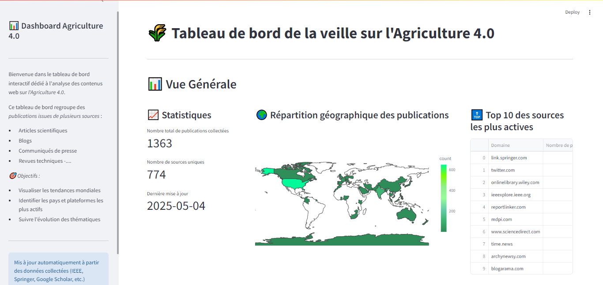
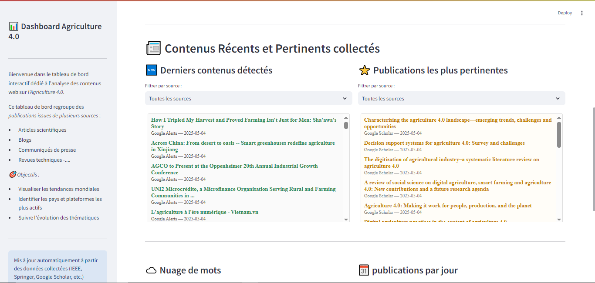
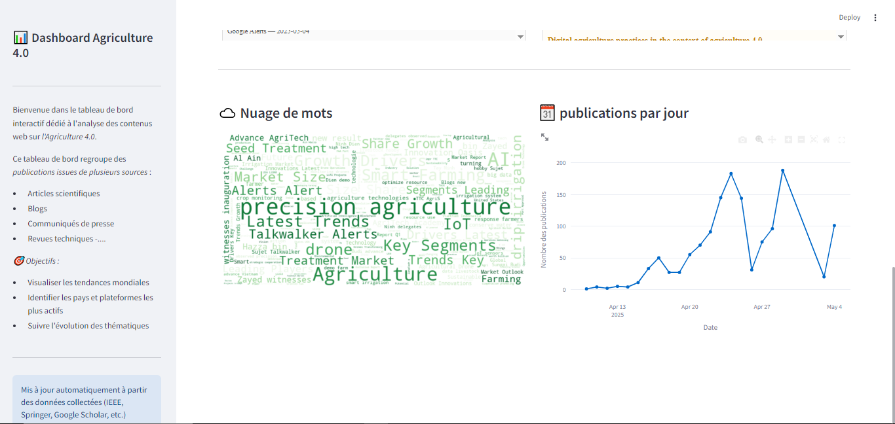

# 🌾 Veille Agricole 4.0 – Web Scraper & Dashboard Project

This project automates the collection and analysis of academic and alert-based content on **Agriculture 4.0**, using custom web scrapers and a fully interactive dashboard built with **Streamlit**. The data is stored in **MongoDB** and processed for credibility before visualization.

---

## 📁 Project Structure

```
.
├── scrape_google_alert.py                   # Fetches Google Alerts via Gmail API
├── scrape_google_scholar.py                 # Queries Google Scholar via SerpAPI
├── scrape_ieee.py                           # Scrapes IEEE Xplore articles
├── scrape_springer.py                       # Scrapes SpringerLink
├── scrape_wiley.py                          # Scrapes Wiley Online Library
├── scrape_talkwalker/
│   ├── auto_save_to_talkwalkerfolder.py     # Saves Talkwalker emails via IMAP
│   └── extract_informations_from_talkwalker.py  # Extracts articles from saved Talkwalker
├── credibility_test.py                      # Filters out non-credible publications
├── app.py                                   # Streamlit dashboard for data visualization
├── daily_scraper_scheduler.py               # Central scheduler for daily automation
├── requirements.txt                         # Clean dependency list
├── .env                                     # Secret config (excluded)
├── .gitignore                               # Git exclusion rules
├── token.json                               # Gmail token (excluded)
└── README.md                                # This file
```

---

## ⚙️ Setup Instructions

### 1. Install Dependencies

```bash
pip install -r requirements.txt
```

Or manually:

```bash
pip install selenium webdriver-manager pymongo schedule requests beautifulsoup4 python-dotenv streamlit
```

---

### 2. Configure Secrets

Create a `.env` file in the project root with:

```dotenv
GMAIL_TOKEN_PATH=token.json
GMAIL_CREDENTIALS_PATH=client_secret_XXXX.json
SERPAPI_KEY=your-serpapi-key
IMAP_EMAIL=youremail@example.com
IMAP_PASSWORD=your-imap-password
```

> ⚠️ This file is ignored by Git for security.

---

## 🚀 Scraping & Processing

You can run scrapers individually or schedule them:

```bash
python scrape_google_alert.py
python scrape_google_scholar.py
python scrape_ieee.py
python scrape_springer.py
python scrape_wiley.py
python scrape_talkwalker/auto_save_to_talkwalkerfolder.py
python scrape_talkwalker/extract_informations_from_talkwalker.py
```

To run all daily:

```bash
python daily_scraper_scheduler.py
```

Then apply the credibility test:

```bash
python credibility_test.py
```

---

## 📊 Interactive Dashboard

The **Streamlit dashboard** is launched via:

```bash
streamlit run app.py
```

It displays:

- 📈 Global trends and publication growth
- 🌍 Geographic distribution of sources
- 📰 Recent and relevant articles
- 🔝 Top publishing domains
- ☁️ Word clouds from content

### Example Screenshots

#### Vue Générale (Overview)



#### Contenus Récents & Pertinents



#### Nuage de mots & Publications par jour



---

## 📦 MongoDB Collections

- `google_alerts_Agriculture4.0`
- `talkwalker_alerts_Agriculture4.0`
- `ieee_agriculture_4_0_newest`
- `ieee_agriculture_4_0_relevant`
- `wiley_agriculture_4_0_newest`
- `wiley_agriculture_4_0_relevant`
- `springer_agriculture_4_0_newest`
- `springer_agriculture_4_0_relevant`
- `scholar_agriculture_4_0_newest`
- `scholar_agriculture_4_0_relevant`

---

## 🧠 Features

- ✅ Automated scraping with anti-bot behavior
- ✅ Secure handling of sensitive credentials
- ✅ Daily scheduling with `schedule` module
- ✅ MongoDB deduplication
- ✅ Credibility scoring & filtering
- ✅ Streamlit dashboard with dynamic filters

---

> 🎓 Academic project for **Veille Technologique – Agriculture 4.0**  
> Created by a team of data science engineering students.
